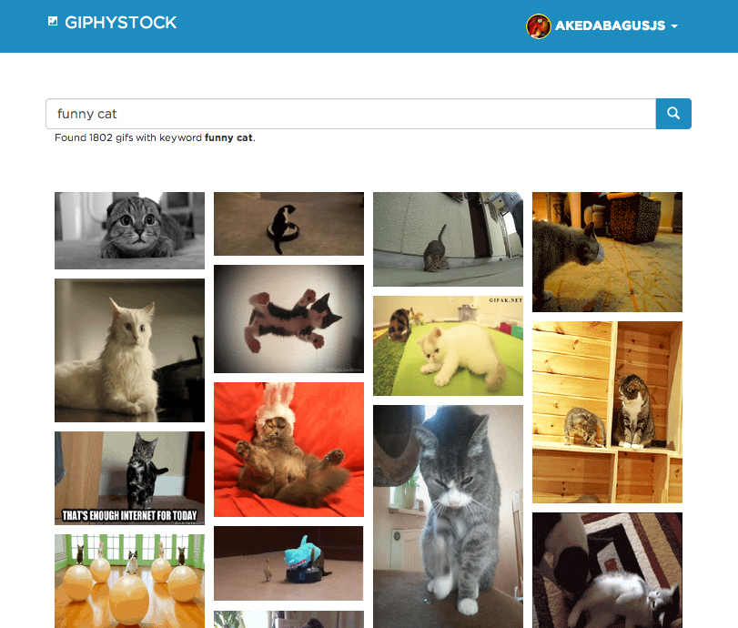

GiphyStock
==========

Stock your WordPress blog media with animated GIF from Giphy.

[Live demo](http://gedex.web.id/GiphyStock) from GitHub page.

## Screenshot



## Build

```
$ npm install # for the first time
$ grunt
```

Build will be available on `dist` directory.

## Deploy to GitHub Page

```
$ grunt gh-pages
```

## Credits

* [Sulfur](https://github.com/Automattic/sulfur)
* [Giphy API](https://github.com/Giphy/GiphyAPI)

## License

MIT License - see [LICENSE](./LICENSE) file.

